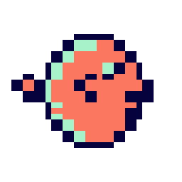

<p align="center"></p>
<h1 align="center">MiniFugu</h1>
<p align="center">A small, persistent, keyless Turbopuffer API emulator in Rust.</p>
<p align="center"><a href="https://github.com/Symbolic-ai/minifugu/actions/workflows/ci.yml"></a> <a href="LICENSE"></a> </p>

MiniFugu lets local apps and CI exercise real HTTP writes, schema validation, filters, vector search, and text search without a Turbopuffer account. It ranks small collections with **exact dense and sparse vector search**, **late-interaction multi-vector search**, and **BM25**. It accepts any nonempty bearer token; no network service or API key is needed in its default mode.

MiniFugu is an independent open source project and is not affiliated with Turbopuffer. See [API coverage](docs/api-coverage.md) for precise compatibility and known differences.

## Quick start

Requires Rust 1.98 or newer.

```sh
cargo run --release
# http://127.0.0.1:8787
```

Use a dummy token and point your client's Turbopuffer base URL at `http://127.0.0.1:8787`:

```sh
MINIFUGU_TOKEN=local-test
curl -sS http://127.0.0.1:8787/v2/namespaces/demo \
  -H "Authorization: Bearer $MINIFUGU_TOKEN" -H 'Content-Type: application/json' \
  -d '{"schema":{"id":"uint","title":{"type":"string","full_text_search":true},"vector":{"type":"[2]f16","ann":true}},"distance_metric":"cosine_distance","upsert_rows":[{"id":1,"title":"small fugu","vector":[1,0]},{"id":2,"title":"blue whale","vector":[0,1]}]}'

curl -sS http://127.0.0.1:8787/v2/namespaces/demo/query \
  -H "Authorization: Bearer $MINIFUGU_TOKEN" -H 'Content-Type: application/json' \
  -d '{"queries":[{"rank_by":["vector","ANN",[1,0]],"limit":2},{"rank_by":["title","BM25","fugu"],"limit":2}],"rerank_by":["RRF"],"limit":2}'
```

Set `MINIFUGU_LISTEN=0.0.0.0:8787` to listen on another address. The default binds localhost.

## Keep data across restarts

Set `MINIFUGU_DATA_DIR` to store all namespaces in a local JSON snapshot:

```sh
MINIFUGU_DATA_DIR="$HOME/.local/share/minifugu" cargo run --release
```

Writes use a temporary file, file sync, and rename before the HTTP request succeeds. On startup, a corrupt snapshot stops the server instead of clearing data. On Unix, MiniFugu sets the data directory to `0700` and the snapshot file to `0600`. The snapshot is **not encrypted**; the `encryption.sse` metadata value is a compatibility field for the HTTP API. This is intended for a single small local instance; it does not provide concurrent process access, sharding, or large-scale indexing. Leave the variable unset for an empty in-memory store on every start.

## Embeddings

Explicit vector fields work offline. A schema can also ask MiniFugu to generate an `embed_<field>` vector from text:

```json
{"content":{"type":"string","full_text_search":true,"embed":{"model":"openai/text-embedding-3-small","dims":1536}}}
```

The default provider hashes tokens deterministically. This keeps CI reproducible and keyless; these vectors are **not semantic embeddings**. For a local query, `minifugu::deterministic_embedding(query, dims)` produces a vector in the same space.

For semantic embeddings, opt in to OpenAI:

```sh
export MINIFUGU_EMBEDDING_PROVIDER=openai
export OPENAI_API_KEY="$(your-secret-manager-command)"
cargo run --release
```

MiniFugu calls OpenAI's embeddings endpoint for native `embed` fields, using the schema model and dimensions. `MINIFUGU_OPENAI_BASE_URL` can point at a compatible local test server. The querying client supplies a vector from the same model. Explicit vectors never make provider calls. [OpenAI's embedding guide](https://developers.openai.com/api/docs/guides/embeddings) documents the model and endpoint.

## API surface

| Route | Behavior |
| --- | --- |
| `POST /v2/namespaces/{name}` | Schema and vector metric, row/column upserts and patches, conditional writes, ID deletes, patch/delete by filter, affected IDs, local copy/branch |
| `POST /v2/namespaces/{name}/query` | Single and multiqueries, exact dense and sparse ANN/kNN, late-interaction ranking, BM25, RRF fusion, text and fuzzy filters, numeric ranking expressions, ordering, `limit`/`top_k`, offset, attribute selection, computed BM25/vector scores, text highlighting, Count/Sum aggregations with multiple group fields and `ForEachUnique` |
| `DELETE /v2/namespaces/{name}` | Delete a namespace |
| `GET /v1/namespaces` | List namespace IDs with prefix, cursor, and page size |
| `GET/POST /v1/namespaces/{name}/schema` | Read and extend a schema |
| `GET /v1/namespaces/{name}/metadata` | Read schema, local estimates, timestamps and index status |
| `PATCH /v1/namespaces/{name}/metadata` | Set or clear persistent `read_only` state; non-null cloud pinning is unavailable locally |
| `GET /v1/namespaces/{name}/hint_cache_warm` | Acknowledge a cache warm hint |
| `POST /v1/namespaces/{name}/_debug/recall` | Measure exact local vector recall |
| `POST /v2/namespaces/{name}/explain_query` | Explain the local exact scan plan |

Supported filters include `And`, `Or`, `Not`, equality, `In`/`NotIn`, numeric/date ranges, array containment, full-text token matching, and fuzzy substring matching. Dense vectors can be sent as float arrays or little-endian float32 base64; base64 query responses use the schema's f32, f16, or i8 element width. Sparse vectors use `{}f16` maps and multi-vectors use `[][N]f32` arrays. Queries validate referenced attributes even when no rows match. Unsupported request fields fail, so a test cannot silently pass when MiniFugu cannot emulate the operation. See [API coverage](docs/api-coverage.md) for exact details and remaining gaps.

Behavior checked against live Turbopuffer includes full-text analysis options, highlighting, normalized schema responses, aggregation edge cases, metadata changes, and generated query and write sequences. The [parity checks](docs/api-coverage.md#behavioral-parity-checks) show the evidence and scope for each area. MiniFugu still uses exact local scans and local estimates, so approximate ANN recall, cloud billing, and distributed consistency differ.

## Development and compatibility checks

```sh
cargo fmt --check
cargo clippy --all-targets --all-features -- -D warnings
cargo test --locked
```

All ordinary tests are local and keyless. With `TURBOPUFFER_BASE_URL` and `TURBOPUFFER_API_KEY` set, `tests/compatibility.rs` runs its disposable synthetic contract against live Turbopuffer, and `tests/differential.rs` compares 128 generated queries, nine write attempts per namespace, and schema and metadata updates. Run them with `cargo test --locked --test compatibility --test differential`. They delete their namespaces when finished. `tests/openai_live.rs` separately requires `MINIFUGU_LIVE_OPENAI=1` and `OPENAI_API_KEY`. The live tests do not run in CI.

Contributions are welcome; see [CONTRIBUTING.md](CONTRIBUTING.md). Please report security issues privately as described in [SECURITY.md](SECURITY.md).

## License

The software and documentation are [MIT licensed](LICENSE). The MiniFugu logo is separate project artwork; see [assets/README.md](assets/README.md).
